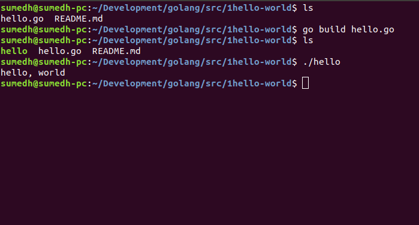
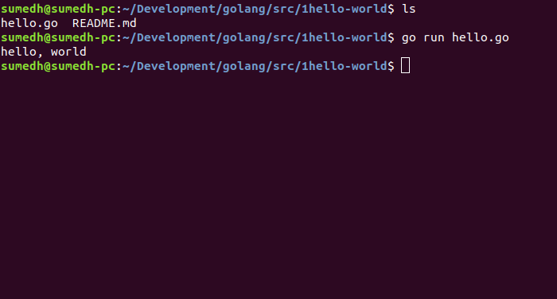

# golang

This repository can be used as a tutorial for beginners in Golang.

## Usage

### 1) Download Golang on your computer

You can download Golang from [here](https://golang.org/dl/)

### 2) Installation and Setting GOPATH

Follow the instructions [here](https://golang.org/doc/install) for your operating system

### 3) Clone this repository

```bash
git clone https://github.com/Sumedh-Patkar/golang
```

### 4) Run Go programs

  Switch to the required directory in terminal

  For example
  ```
  cd /<your-path>/golang/1hello-world/
  ```

  There are two ways for running programs

  #### 1. Using Go build

    ```
    go build hello.go
    ```
  This will create an excecutable file named ```hello``` in the same directory

  You can run it using
    ```
    ./hello
    ```
    
  <p align="center">
    
  </p>

    
  This method is useful when you have more than one ```.go``` files in your project

  A simpler method for single ```.go``` files is

  #### 2. Using Go run

  Directly run the program using 
    ```
    go run hello.go
    ```
  <p align="center">
    
  </p>
  

Please raise an issue if you find any errors in the code or documentation.

